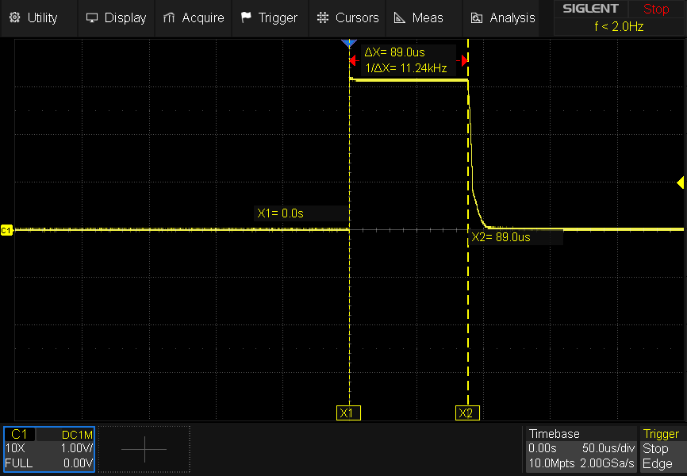

# FET coil measure test

In this test we use the secondary FET with the inline 6R8 resistor along with the ADC measure pin
to check the coil present/open/short functionality.

We only run the test on the coil1 circuit, presuming the coil2 circuitry is the same.

We program the FET enabling pin as an open drain, thus giving us the ability to pull the pin low
(as this is a P-channel FET, pulling low enables the FET), or leaving it as a high impedance float,
in which case the pullup resistor on the FET gate turns the FET off.

We then use the sense pin as a 12bit ADC sample to read what voltage is present between the sense
resistor and the coil heater. As we are measuring in 12bits, the max digital value we expect to
get is 4095. There are three basic scenarios:

 - if the coil is present, the voltage will be split between the coil and the sense resistor, and
   we should find a voltage somewhere larger than 0 but smaller than 4095.
 - if the coil is shorted it will pull the sense point to ground, and we should read 0.
 - if the coil is open then the sense resistor will float to VDD, and we should read 4095.

To summarise:

| Measure | meaning      |
| ------- | -------      |
| 4095    | Open coil    |
| 1-4094  | OK coil      |
| 0       | Shorted coil |

  Note: due to ADC bottom bit resolution etc., 1 and 4094 should not be taken as an absolute coil OK.
  A real value or range should be determined with the actual coil in place.

In order to show the results here, we cycle through having the FET enabled or disabled (shown by the
presence of the teardrop on the display), and 'scroll' the resulting 4-digit decimal result across
the two digits of the display. It's the best we can do with the debug resources available.

## In practice

I started out placing a 100ohm resistor across the coil pins, but that prevented my test setup from
running. I believe this is as we were drawing too much current from the PiPico 3v3 driving the whole
system, but in theory we should have been fine, as the PiPico docs say we can draw upto 300mA, and we
should have been below that.

I then switched to using a 3k3 resistor across the coil pins, and the unit booted and acted more like
we expected. This is not ideal, as we end up with a 'coil OK' reading of around 4090, which is not much
different from an open coil - but, it was consistent enough to prove the system was working as expected.

## The test pulse

The test code tries to keep the test pulse as short as possible - it enables the FET, does the ADC
measure, and turns the FET off again. The theory here is that if we did have a short on the coil then
you probably want to enable that for as short a time as you can. I was curious just how short a pulse
we were using, and the determining factor here is probably how fast an ADC conversion we have set up.

I hooked up the scope across the 3k3 test load, and we can see:

Well, that's an 89uS pulse - pretty good.

## Notes

To note then, if we were running the system directly off the 3.7v Lipo battery then I think we'd
expect to be able to use a much lower resistance load, such as the 1.1ohm vape coils in the original
vape. I've not tested this theory though, as that would involve using a separate power supply to
the DAP probe I built, and my PiPico DAP probe does not have the 'target voltage' functionality to
make that easily workable.

