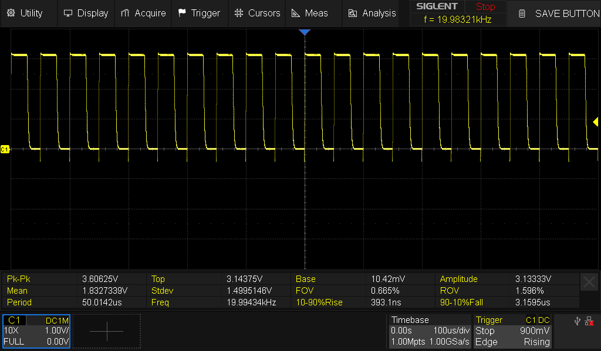

# FET pwm test

Finally, let's run the main coil power FET as a PWM, as that might be how one expects to use it when
running as a real vape coil.

I had some trouble getting this example running. That is probably as I copied some snippets out from
the
[example in the decaday repository](https://github.com/decaday/PY32F0_Drivers/tree/main/Examples/PY32F002B/Example/TIM/TIM1_PWM).
The key items I probably missed, that are found in the `py32f002b_hal_msp.c` file is the enabling
of the TIM1 clock. Before I did that and configured the GPIO pin to be on the alternate function
I got no output.

It's not obvious to me where the `_msp.c` files come from, but it feels like maybe they are auto
generated from some config GUI. I prefer to 'see' the code for myself in the example file.

## Details

Details then. We set up the timer PWM function for the appropriate timer on the first coil primary
FET - that is, TIM1_CH4 on PA7.
We configure the Timer prescaler to be '12', to give us a 2MHz input clock from the 24MHz main clock,
and set the PWM counter period to be '100', to give us a configurable PWM ratio of 0-99, and a main
PWM clock of 2M/100 == 20KHz.

In this test we ran with the 3k3 resistor across the vape coil terminals, and use the oscilloscope to
verify our output. You can see we have a (very nearly) 20KHz PWM with a 50/50 ratio.

