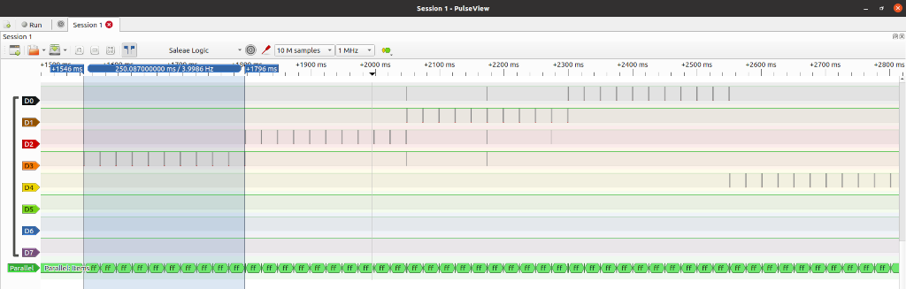
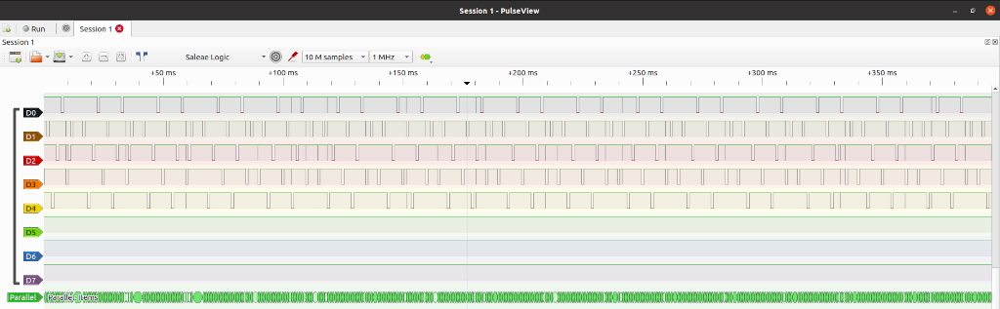

# Charlie plex LED walking example

In this example we walk around the LEDs from a 'top level', whilst at the lower level we use a timer
tick driven charlieplexing. This allows us to have more than one LED alight 'at the same time', by
doing a fast (1khz) switching between the currently lit LEDs.

The code has three 'cycles'.

 - Light one LED at a time
 - light all ones, incrementing one at a time
 - turn off LEDS one at a time

the below logic capture shows the individual LED mode. You can see the 1Khz LED lighting mode series
that forms the 250ms on/off sequence:

and this capture shows multiple LEDs lit at the same time, where you can see the 1KHz mode cycling
through the lit LEDs over the 250ms period:

