# Pruya PY32C642F15 Hayati Pro Ultra vape examples

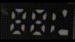

Hacking the 32bit Arm M0+ processor board from inside a
[Hayati Pro Ultra vape][1].

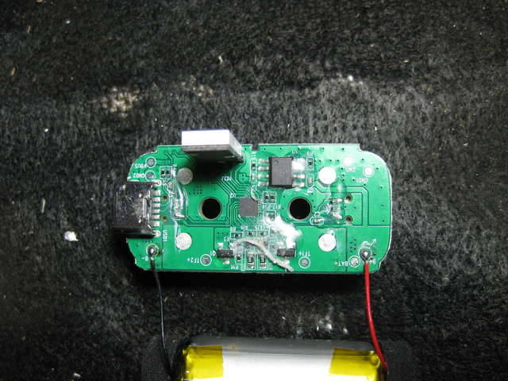

This repository contains details and information so far obtained about the small Pruya F32C642F15
based processor board contained inside a vape.

Many vapes contain a Lithium Ion battery, a small pressure sensor and an evaporation coil, but some
of them are getting 'smarter', and now contain a small microprocessor and a display.

The [Hayati Pro Ultra vape][1] contains a small 32bit Arm M0+ microprocessor and a 19 LED display
panel and a USB-C charge port and LiPo charger chip.

## Background

I've been collecting up discarded vapes for a couple of years, and recovering the Lithium Ion batteries
out of them for use in other projects (this is a well documented 'hobby' in the maker community etc.).

Normally I just find simple vapes, but recently, around December 2024, I started to find these
Hayati vapes that have a display and are USB rechargeable. There must have been a group buy or something
near where I live, as I went from finding none of them to finding 4 within 2 weeks!

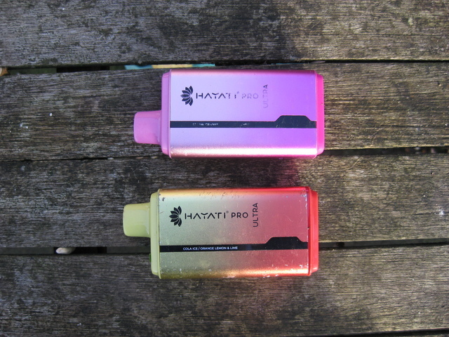

On opening up the vape we find there is a smaller than usual battery, but also a microcontroller board
with a little LED display.

Well, I'm a microprocessor embedded geek, I could not resist - let's get hacking!

## First look

Right, let's see what is inside the vape. These are pretty easy to get apart. Use a spudger or similar
to ease the bottom off the vape, and it just pulls out. Nicely the vape coils are connected using
two pairs of sliding pins, so it just pops right out and leaves all the nasty fluid soaked gubbins
inside, which I then just throw in the bin.

Now, clean up the board a bit (there was some sticky glue that was easily cleaned off), and then try
to identify the components. I'll note here, that the first board I stared at had a thin coating of
[Conformal Coating](https://en.wikipedia.org/wiki/Conformal_coating), but you could mostly still read
the chip markings through it. The next board I pulled out had a much thicker coating that seemed to
have soaked into the component etchings so well that I could barely read a thing off them... just luck
the first board I pulled I could read!

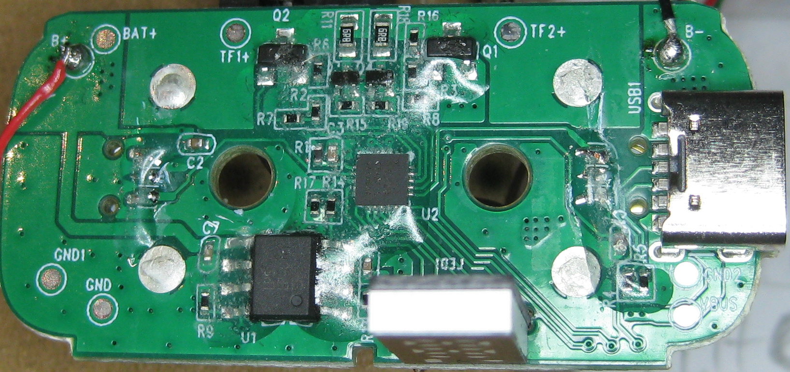

### PY32F642F15

First, there is that processor. Getting a good light and a loupe on it, we find it is a `C642F15`.
Digging further, we identify it as a Puya PY32C642F15 microcontroller. Great, we have some smarts,
and it's not just a little OTP 8-bitter - this is a 32bit re-flashable chip! There is a bunch of
information out there on the [Puya py32 chips](https://py32.org/en/mcu/), but not much information
on the PY32C642 itself. More on that in a bit.

### LPS LP4076E

The other main chip is an [`LPS LP4076E`](http://www.lowpowersemi.com/Product-detail/18-LP4076E),
which is the USB LiPo charge chip.

### The display

There is the 2 1/2 digit 7-segment display with a few extra indicator LEDs:

  - a 'teardrop' symbol
  - a 'battery' symbol
  - a 'percentage' symbol

it appears to have 5 soldered connetions to it. As we will find out later, this is a
GPIO [charlieplexed](https://en.wikipedia.org/wiki/Charlieplexing) display.

### SWD testpoints

And then flipping the board we find there is a set of four little test points next to the screen
labelled:

 - V+
 - DA
 - CK
 - G-

Yay, this looks like it is going to be a program header, so there is a chance we might be able to
reprogram the flash!

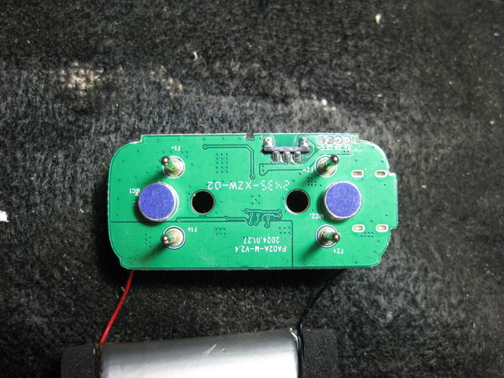

## Reference material

First task was to find if there was already any information out there on the PY32C642. A search showed
up very little, but, there was another vape related reference on
[reddit](https://www.reddit.com/r/embedded/comments/1eozp71/puya_py32_c642_in_a_disposable_vape/) that
also pointed to a Chinese version of the datasheet, which also turns up on
[a github here](https://github.com/decaday/PY32_Docs/tree/main/PY32C642/Datasheet).

Somewhere I found another reference that noted the C642 was very similar to an CY32F002B.
We'll get more on that later, but you can find some documents in the [Documents folder](./Documents).

## SWD, or not

  > Note: on this particular board, the LiPo battery was **dead** - like, down to 0.3v or so. At that
  point I'm not even willing to try and recover that cell, so snipped it off. I strongly suspect that
  when doing any SWD connection to the board - *unless* you SWD pod as a target voltage reference
  input pin and relevant buffers - you should probably disconnect the battery and not plug in any
  USB power whilst using SWD, and instead power the board from the SWD dongle.

First job then, wire up the SWD and see if we can access the chip. Oh, but, I didn't have an SWD pod to
hand. No problem, I found [this repo](https://github.com/ataradov/free-dap) that lets you trivially
turn a PiPico into a CMSIS-DAP debug pod. That's the route I took.

Once I came to solder the wires to my board, I found that the VCC pin on my SWD header had effectively
'melted away'. It looks like that pad was not covered in solder mask or glue, and maybe the vape
fluid or some other moisture had corroded it - whatever it was, it looked to have turned that whole
pad into 'copper sludge'. I cleaned it off, and was left with basically no pad. Luckily this was one
of the power pads, and I could just wire to the battery + contact instead.

I started off just wiring the PiPico pins direct to the SWD pins. I tried
[edbg](https://github.com/ataradov/edbg) from the same author of `free-dap`, but had no joy. I then
tried `pyocd`, and still no joy (all the time telling the tools this was a `cy32f002b`, as they don't
have native support for the `c642`. More thought required....

I'd seen mention that some pull up/down and/or series impedance matching resistors may be needed on
an SWD connection. Had a look around and found a reference on the
[Arm developer site](https://developer.arm.com/documentation/dui0499/k/arm-dstream-target-interface-connections/signal-descriptions/serial-wire-debug?lang=en).

I added in both the pullup and the series resistors, told the tools to crank their speed down to 1MHz,
and voila, I could talk to the target!

  > Note: OK, there is some anomoly here you should be aware of. I cannot talk to the target with
  `pyocd` directly after a power up until I've tried to talk to the board with `edbg`. Once I've done
  that once then things continue to work until I power cycle the board again. There must be an extra
  sequence or step required somewhere, and maybe I'll track that down later if I find the time.

What I did find is that I **must** run the `edbg` command once first thing to 'activate' the board,
even though that command effectively fails, and from then on I can use `pyocd` to program up the
flash. For reference, here are the commands I effectively use:

```bash
$ ./edbg -t py32f0 -c 5 -r
$ pyocd load ./build/blink.bin -v -v -v -t py32f002bx5 -Ofrequency=1000000
```

## Original firmware

Now we are talking to the target, let's see if the developers have locked it down at all. Nope, not
as far as I can tell. First thing I did was read off the original firmware as a 'safety, back to
default' backup. I have re-burnt this firmware a number of times since, and it seems to work fine.

```bash
$ pyocd cmd -v -t py32f002bx5 -Ofrequency=1000000 -c savemem 0x08000000 0x6000 flash.bin
```

## The processor

Now we can talk to the target, let's look at the processor a little more. wrt other Puya chips, it
looks to be very similar to a PY32F002B, but with a bunch of the peripherals missing. For instance,
it looks like we don't have the SPI, I2C, RTC or UART. Here is what we do have:

 - Arm Cortex 32bit M0+ at upto 24MHz
 - 24k of Flash and 3k of RAM
 - A number of internal and external clock options
 - Sleep and Stop low power modes
 - 18 GPIOs
 - A 10 channel 12bit 1msps ADC
 - Numerous timers
 - A couple of comparators
   - the combination of which allows us to do interesting things, like PWM and interval timing.
 - SWD debug access

All in all, a nice tiny little 20 pin chip, but with none of the useful wire wiggling peripherals.

## The display

The display having 5 pins could have been almost anything. Given the host cpu does not have I2C or SPI
though, and there are other references out on the internet indicating some of these 'mid level' vape
displays are made of [Charlieplexed LEDS](https://en.wikipedia.org/wiki/Charlieplexing). I'll take
that as my first guess then, as a 5-wire charlieplex can control 5*(5-1) LEDS == 20 LEDS, and we only
have 19 to control... it would fit.

I powered up the board with the original firmware, where it initially flashes all the LEDs six or so
times, and did a logic capture on the 5 display pins:

  > Note: If you want a very cheap but effective entry into the logic capture world, I can recommend
  one of the simple cheap Saleae Cypress chip little USB logic pods. I got a very cheap clone, and
  use it with sigrok under Linux. Have a look at the sigrok site for
  [an example](https://sigrok.org/wiki/Noname_Saleae_Logic_clone).

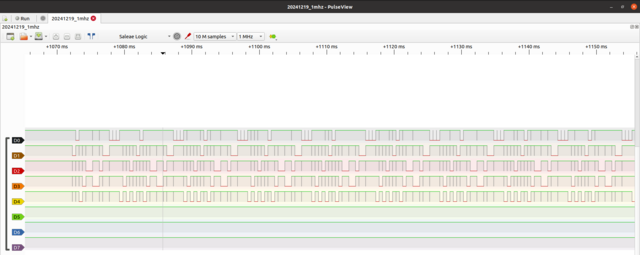

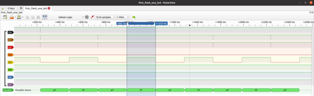

Indeed, those look like charlieplexed type signals to me. I wired/decoded the display using what
looked like a tiny '1' just about visible on the display pcb to assign pin numbers - this may not
be how the original designer assigned them, but it doesn't really matter as we are writing our own
software to drive this. Here is what I came up with:

| Display Pin | charlie pin | GPIO pin |
| ----------- | ----------- | -------- | 
| 1           | 0           | PA1 |
| 2           | 1           | PA0 |
| 3           | 2           | PB0 |
| 4           | 3           | PB1 |
| 5           | 4           | PB2 |

After prodding the display with the example code, we can decode the digits to the below image. The
first digit denotes a the 'charlie number', which describes the two pins in order of 'pin high' and
'pin low'. Eg, the teardrop is charlie number 41, so set charlie pin 4 as high and charlie pin 1
 as low. The second number, in brackets, represents a 'linear position' of the led - e.g., if we try
to describe them as LEDs 0-24 - where 'pos/5' == 'pin high' and 'pos%5' == pin low. This is actually
an easier way to describe the led relationship to the GPIO pins inside the code, and is used in the
LED walking and 7-digit display code for example.

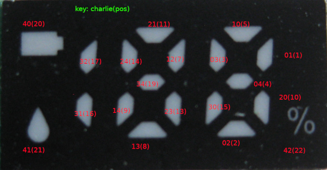

## Pressure sensor inputs

There are two, what are presumed to be, pressure sensors on the board - this was a 'dual flavour' vape,
and thus the two sensors (and also, two FET driven vape coil outputs).

According to our schematic examination, we think the sensors are on PA3 and PB5.
After constructing some code in the [pressure sensor example](./Examples/pressure_sensors), it looks
like these are digital inputs that (as expected) trigger on negative pressure only (that is, a mild
vacuum). Use them via GPIO input functionality.

## FETs

afaict, they are numbered (and it is quite hard to tell on the small ones, due to their size and
that they are covered in clear epoxy....)

  - Large ones: R15. Searching, that might be a CJ3415. 20V, 4A

    https://www.lcsc.com/datasheet/lcsc_datasheet_1810010217_Jiangsu-Changjing-Electronics-Technology-Co---Ltd--CJ3415-R15_C77896.pdf

  - Small ones: 39k
    Search for marking: https://www.alldatasheet.net/view_marking.jsp?sField=0&Searchword=39K&list=988
    Let's guess then an UnSemi UN200P32TE, 20v, 660mA
    https://www.un-semi.com/site/document?id=462&PartNumber=UN200P32TE&spm=docs

Now, both of those seem to be p-channel mosfets, whereas n-channel are much more common. Let's see how
the schematic works out... OK, after staring, probing and coding (and, the FETs were probably the
hardest bit to figure out on the board), it does look like there are a pair of high-side switching
P-channel FETs per coil, and one ADC feedback pin. One of the FETs is used to power the coil via a
load resistor (6R8), and the ADC feedback pin can then be used to check if the coil is present or
shorted before applying the full un-restricted power via the main FET.

## Coils

Related to trying to work out how the FETs work, particularly with the open/short circuit detection.
There are references to the vape coils in the Ultra Pro having a resistance of 1.1ohms - so, let's
put that on the schematic.

## Board shots

To try and work out where things are wired, and how a schematic might look, I tool some high res closeup
photos of the board. The board looks to be only two layers, which is good for us. Backlighting the
board helped highlight some of the traces.

## pinout

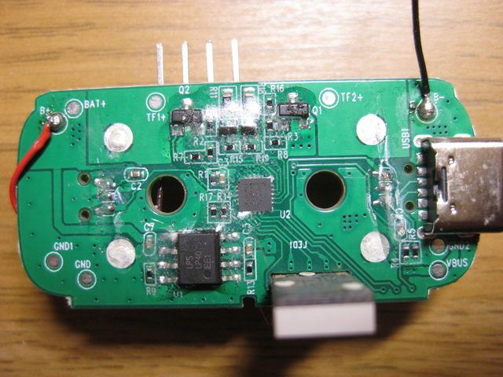

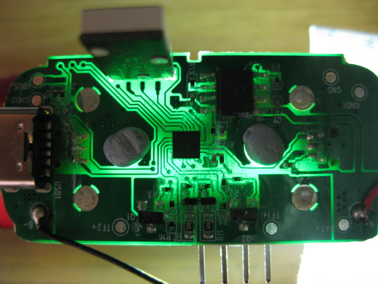

| Pin | function | notes |
| --- | -------- | ----- |
| 1   | PC0-NRST | n/c |
| 2   | PC1      | fet coil2 voltage measure FET switch |
| 3   | PB7      | fet coil1 voltage measure FET switch |
| 4   | VSS      | GND |
| 5   | PB6-SWD  | SWD header |
| 6   | VCC      | r/c net to via - thick track, power |
| 7   | PB5      | pressure sensor away from USB port |
| 8   | PB4      | lipo charger voltage in monitor |
| 9   | PB3      | Unconnected |
| 10  | PB2      | display |
| 11  | PB1      | display |
| 12  | PB0      | display |
| 13  | PA0      | display |
| 14  | PA1      | display |
| 15  | PA2-SCK  | SCK SWD header |
| 16  | PA3      | pressure sensor near USB port |
| 17  | PA4      | fet coil2 voltage measure |
| 18  | PA5      | fet coil2 main FET switch |
| 19  | PA6      | fet coil1 voltage measure |
| 20  | PA7      | fet coil1 main FET switch |

  > Note: oh, just a note here - I think there is a typo error in the PY32C642 PDF. In the QFN20 pin
  diagram (the picture), it shows SCK being on PB2. This it not correct, it is actually on PA2, as
  detailed in the textual table in the PDF. That caught me out for a bit when decoding the pcb.

## Schematic

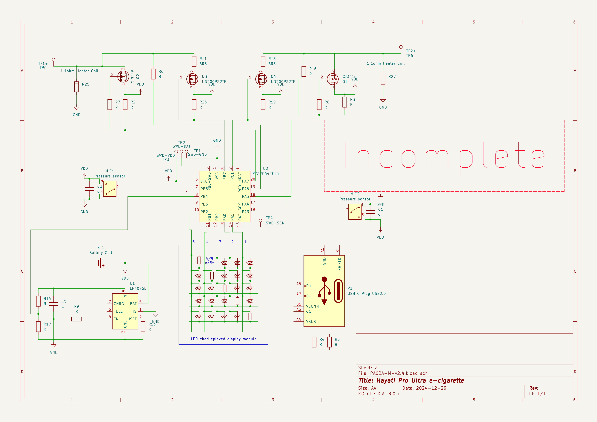

## Examples

The Examples folder contains numerous examples used to explore and illustrate the useage of the board.

See the [README file](./Examples/README.md) for more information the the specific examples.

## My sample boards

So far I have found four of these vapes. I chose one of my first two finds as my 'dev board', and
the rest are fairly unmolested so far.

My dev board has shown some strange anomolies, including:

  - Stop mode current is more like 3mA, rather than the 7uA I can see on a 'virgin' board
  - When powered from 5V USB, the board display goes a bit 'freaky', showing things that should
    not be there, or are flashing - even with the original firmware.
  - When I found it the battery was effectively completely flat, which I would not expect to happen
    with the expected 7uA stop mode current.

Thus, I have a feeling the board I chose might have a fault.

| Board No. | Bat V as found | Idle current org fw | on USB power | Notes          |
| --------- | -------------- | ------------------- | ------------ | -------------- |
|     1     |    0.3v        |        >3mA         | funky displ. | Corrosion on SWD header |
|     2     |    3.682v      |        6.8uA        | OK           | |
|     3     |    3.439v      |        6.7uA        | OK           | |
|     4     |    0.206v      | 450uA, displ. duff  | not right    | Corrosion on SWD and display |

I think the finding here is - if you find one of these vapes with a totally flat battery and/or
some corrosion on the PCB then maybe it's already bust, and you might save yourself a bunch of effort
by just binning it.

[1]: https://hayativapor.com/pages/product-pro-ultra

